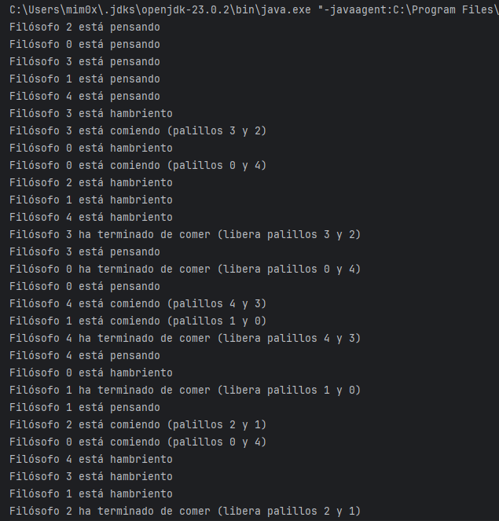

# Tarea PSP02 - Problema de los filósofos comensales en Java
## Introducción

[Enlace repositorio:](https://github.com/little-shiny/PSP02-Filosofos)

El problema de los filósofos comensales es un problema clásico de la programación concurrente que se 
utiliza para ilustrar los problemas de sincronización y acceso a recursos compartidos entre múltiples 
procesos o hilos.

En esta práctica se implementa dicho problema utilizando el lenguaje Java, haciendo uso de hilos y 
semáforos para garantizar la correcta sincronización entre los filósofos y evitar problemas al acceder a los recursos 
compartidos (palillos).

## Descripción del problema
El problema consiste en cinco filósofos sentados alrededor de una mesa circular. Entre cada par de filósofos hay un palillo, por lo que hay un total de cinco palillos. Cada filósofo alterna entre dos estados:
 - Pensar
 - Comer

Para poder comer, un filósofo necesita dos palillos, el de su izquierda y el de su derecha. Los palillos son recursos compartidos, por lo que solo pueden ser utilizados por un filósofo a la vez.

## Planteamiento para resolverlo
Cada filósofo se implementa como un hilo (clase `Filosofo`) y cada palillo como un semáforo. Los semáforos se 
inician con un solo permiso y así no pueden usarse por más de un filósofo a la vez.
Se emplea un array de semáforos donde cada posicion es un palillo y una matriz donde indica que palillos necesita cada filósofo para comer.

## Implementación
### Clase `Filosofo`
Esta clase extiende de `Thread` y representa como se comporta cada filosofo
**Atributos**
- `indice` -> Identifica al filósofo (como una ID)
- `semaforoPalillo` -> array de semáforos que representa los palillos
- `palillosFilosofo` -> matriz donde indica que palillos necesita cada filosofo

**Método `run()`**
El método `run()` implementa un bucle infinito en el que el filósofo alterna entre pensar y comer:
```java
while (true) {
    pensar();
    comer();
}
```
**Método `pensar()`**

Este método muestra un mensaje indicando que el filósofo está pensando y simula dicha acción mediante una pausa aleatoria del hilo.
```java
public void pensar() {
    System.out.println("Filósofo " + indice + " está pensando");
    try {
        Thread.sleep(random.nextInt(1000) + 500);
    } catch (InterruptedException e) {
        e.printStackTrace();
    }
}
```

**Método `comer()`**

En este método el filósofo:
* Indica que tiene hambre
* Intenta adquirir los dos palillos necesarios mediante los semáforos
* Come durante un tiempo aleatorio
* Libera los palillos al finalizar
* 
El uso de semáforos garantiza que un palillo no pueda ser utilizado simultáneamente por más de un filósofo.

### Clase principal `Main()` 

La clase principal se encarga de inicializar los recursos y lanzar los hilos.

**Inicialización de palillos**
```java
Semaphore[] palillos = new Semaphore[NUM_FILOSOFOS];

for (int i = 0; i < NUM_FILOSOFOS; i++) {
    palillos[i] = new Semaphore(1);
}

```
Cada palillo se representa mediante un semáforo con un único permiso.

**Asignación de palillos a filósofos**
```java
int[][] palillosFilosofo = {
    {0, 4},
    {1, 0},
    {2, 1},
    {3, 2},
    {4, 3}
};
```

Esta matriz indica explícitamente qué palillos necesita cada filósofo para comer, representando la disposición circular de la mesa.

| Filósofo | Palillo izquierdo | Palillo derecho |
| -------- | ----------------- | --------------- |
| 0        | 0                 | 4               |
| 1        | 1                 | 0               |
| 2        | 2                 | 1               |
| 3        | 3                 | 2               |
| 4        | 4                 | 3               |

**Creación y ejecución de hilos**
```java
for (int i = 0; i < NUM_FILOSOFOS; i++) {
    new Filosofo(i, palillos, palillosFilosofo).start();
}
```
Cada filósofo se ejecuta como un hilo independiente.

La sincronización se realiza mediante el uso de semáforos:

* Un filósofo que intenta adquirir un palillo ocupado queda bloqueado automáticamente
* Cuando el palillo se libera, otro filósofo puede utilizarlo
* Se garantiza la exclusión mutua y se evitan condiciones de carrera

## Ejemplo de ejecucción del programa


## Conclusiones
Con esta práctica se ha conseguido implementar correctamente el problema de los filósofos comensales utilizando Java. El uso de hilos y semáforos permite comprender la importancia de la sincronización en sistemas concurrentes y cómo gestionar el acceso a recursos compartidos de forma segura.

Esta práctica refuerza conceptos fundamentales de la programación concurrente y el uso de mecanismos de control de concurrencia en Java.